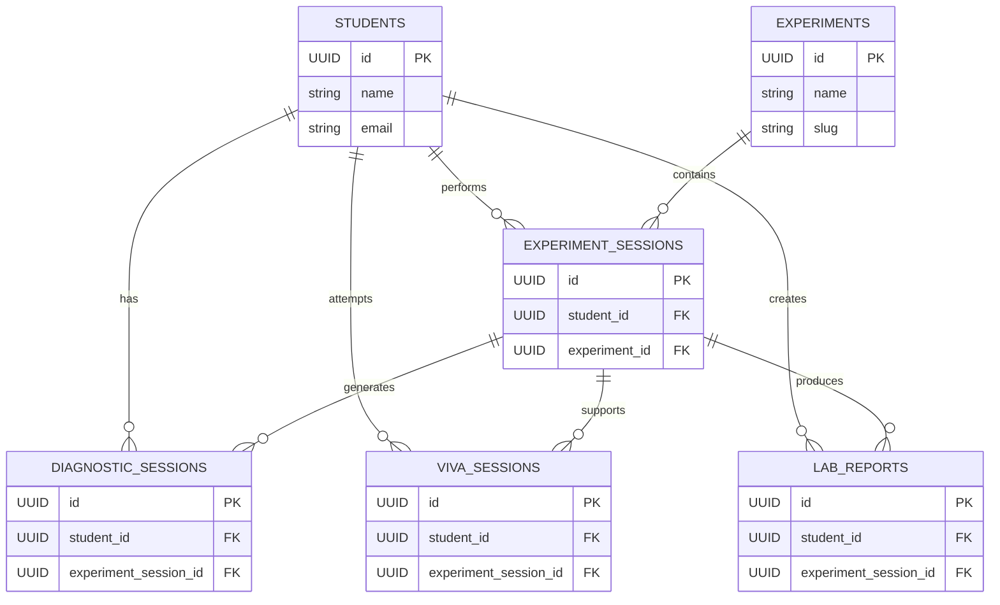

# 🧠 LabMind — AI-Powered Smart Laboratory & Digital Twin Platform

> **From performing experiments to understanding them.**

LabMind is an **AI-powered smart laboratory platform** designed to help students learn, simulate, troubleshoot, practice viva, and document laboratory experiments through a single intelligent environment.

It combines a deterministic experiment simulation engine with **Generative AI, computer vision, adaptive viva, automated reporting, analytics, and a 3D digital twin of laboratory hardware**.

---

## 🚀 Why LabMind?

Traditional laboratory learning is often fragmented:

**Perform Experiment → Unexpected Output → Manual Troubleshooting → Ask for Help → Prepare Viva → Write Report**

LabMind connects this entire workflow into one platform.

### LabMind helps students:

* 🔬 Perform interactive laboratory experiments
* 🤖 Ask an AI tutor questions about experiments
* 🛠️ Diagnose circuit and experiment failures
* 👁️ Analyze circuit images using computer vision
* 🎤 Practice adaptive AI-generated viva questions
* 📄 Generate structured laboratory reports
* 📊 Track experiment and learning analytics
* 🧩 Explore experiments through an interactive 3D digital twin

---

# ✨ Core Features

## 🔬 Interactive Experiment Simulation

LabMind currently supports digital electronics experiments including:

* Logic Gates
* Half Adder
* Full Adder
* 4:1 Multiplexer

The deterministic simulation engine calculates expected and observed outputs while allowing students to interact with circuit inputs and faults.

---

## 🛠️ AI-Powered Troubleshooter

The troubleshooting system combines deterministic circuit state with AI-assisted reasoning.

### Context used by the diagnostic layer

```text
Experiment
     +
Expected Output
     +
Observed Output
     +
Injected Fault
     +
Current Experiment State
     ↓
Context-Aware Diagnosis
     ↓
Likely Cause + Explanation + Guidance
```

Instead of simply saying **"Wrong Output"**, LabMind helps explain **why the output is wrong** and what the student should investigate.

---

## 🤖 AI Tutor

The AI Tutor provides experiment-specific assistance instead of only generic answers.

Students can ask questions about:

* Circuit operation
* Truth tables
* Experiment concepts
* Troubleshooting
* Viva preparation
* Laboratory procedures

---

## 👁️ Vision Inspector

Students can provide circuit images for AI-assisted visual inspection.

The system is designed to help identify potential:

* Wiring problems
* Incorrect connections
* Component placement issues
* Circuit inconsistencies

---

## 🎤 Adaptive AI Viva

LabMind converts laboratory experiments into interactive viva sessions.

The system can generate experiment-related questions and adapt the questioning flow based on the student's responses.

---

## 📄 Lab Report Generator

After completing an experiment, LabMind can generate a structured laboratory report containing relevant experiment information and results.

This keeps documentation connected to the experiment workflow instead of treating the report as a completely separate task.

---

# 🧩 Virtual Smart Lab & Digital Twin

The **Virtual Smart Lab** is one of LabMind's major differentiators.

Instead of displaying only a conventional circuit diagram, LabMind provides an interactive 3D representation of laboratory hardware.

### 3D hardware pipeline

```text
Blender
   ↓
GLB / 3D Assets
   ↓
Three.js + React Three Fiber
   ↓
Interactive WebGL Digital Twin
```

The current digital twin includes:

* DIP IC packages
* Breadboard
* Interactive switches
* LEDs
* Resistors
* Jumper wires
* Power rails

### Blender-generated IC assets

```text
DIP14_7486
DIP14_7408
DIP14_7432
DIP14_7400
DIP14_7402
DIP14_7404
DIP16_74153
```

A representative 24-column × 10-row breadboard asset is also integrated into the Smart Lab.

> The Blender assets are representative educational digital-twin models and are not claimed to be exact manufacturer replicas.

---

# ⏱️ 4D Experiment Timeline

LabMind records experiment state transitions and allows students to:

* Capture experiment states
* Replay previous states
* Pause and resume the timeline
* Scrub through state changes
* Compare input and output states

This creates a lightweight **4D view of the experiment's evolution over time**.

---

# 📊 Dashboard & Analytics

The platform provides a centralized dashboard for:

* Experiment activity
* Diagnostic activity
* Viva sessions
* Lab reports
* Learning statistics

Persistent student data can be stored using Supabase.

---

# 🏗️ System Architecture

```text
                         ┌──────────────────────┐
                         │       Student        │
                         └──────────┬───────────┘
                                    │
                                    ▼
                         ┌──────────────────────┐
                         │    LabMind Web App   │
                         └──────────┬───────────┘
                                    │
            ┌───────────────────────┼───────────────────────┐
            │                       │                       │
            ▼                       ▼                       ▼
 ┌──────────────────┐    ┌──────────────────┐    ┌──────────────────┐
 │ Experiment Engine│    │ AI Intelligence  │    │ 3D Digital Twin  │
 │                  │    │                  │    │                  │
 │ Circuit Logic    │    │ Gemini AI        │    │ Blender Assets   │
 │ Truth Tables     │    │ Troubleshooter   │    │ Three.js / WebGL │
 │ Fault Injection  │    │ Vision           │    │ React Three Fiber│
 └────────┬─────────┘    │ Viva             │    └────────┬─────────┘
          │              │ Reports          │             │
          │              └────────┬─────────┘             │
          │                       │                       │
          └───────────────────────┼───────────────────────┘
                                  │
                                  ▼
                         ┌──────────────────────┐
                         │       Supabase       │
                         │ Persistence & Data   │
                         └──────────────────────┘
                                  │
                                  ▼
                         ┌──────────────────────┐
                         │ Future Cyber-Physical│
                         │ Integration          │
                         │ ESP32 / Sensors /    │
                         │ Real Lab Equipment   │
                         └──────────────────────┘
```

---

# 🗄️ Entity-Relationship Diagram

The following is a **conceptual application-level ER diagram** showing how students, experiments, experiment sessions, diagnostics, viva sessions, and laboratory reports relate to one another.



> **Note:** This diagram represents the application's logical relationships. It is intended as a high-level architecture diagram rather than a claim that every listed field exactly matches the current physical Supabase schema.

---

# 🧠 Key Innovation

## Context-Aware Laboratory Troubleshooting

Many educational AI systems can explain a concept.

LabMind goes further by combining:

```text
Current Experiment
        +
Circuit State
        +
Expected Result
        +
Observed Result
        +
Fault Condition
        +
Student Context
        ↓
Context-Aware AI Assistance
        ↓
Likely Cause + Explanation + Guidance
```

### Core principle

> **The simulator establishes what happened. AI helps explain why it happened.**

This separation keeps the experiment's core logic deterministic while using AI where natural-language reasoning and guidance are valuable.

---

# 🌐 Technology Stack

### Frontend

* Next.js
* React
* TypeScript
* Tailwind CSS

### AI

* Google Gemini
* AI-assisted troubleshooting
* Vision analysis
* Adaptive viva generation
* AI tutoring

### Simulation

* TypeScript-based circuit simulation
* Truth-table generation
* Fault injection
* Expected/observed output comparison

### 3D / Digital Twin

* Blender
* Three.js
* React Three Fiber
* Drei
* GLB assets

### Backend / Persistence

* Supabase
* PostgreSQL

### Development

* Git
* GitHub
* Blender 5.2.2 LTS

---

# 📁 Project Structure

```text
LabMind/
│
├── public/
│   └── assets/
│       └── hardware/
│           ├── Breadboard_24x10.glb
│           └── ic/
│               ├── DIP14_7486.glb
│               ├── DIP14_7408.glb
│               ├── DIP14_7432.glb
│               ├── DIP14_7400.glb
│               ├── DIP14_7402.glb
│               ├── DIP14_7404.glb
│               └── DIP16_74153.glb
│
├── src/
│   ├── app/
│   ├── components/
│   ├── context/
│   ├── data/
│   ├── lib/
│   └── types/
│
├── package.json
├── package-lock.json
├── next.config.ts
├── tsconfig.json
└── README.md
```

---

# ⚙️ Local Setup

## 1. Clone the repository

```bash
git clone <YOUR_GITHUB_REPOSITORY_URL>
cd LabMind
```

## 2. Install dependencies

```bash
npm install
```

## 3. Configure environment variables

Create:

```text
.env.local
```

Add your own credentials:

```env
NEXT_PUBLIC_SUPABASE_URL=your_supabase_url
NEXT_PUBLIC_SUPABASE_ANON_KEY=your_supabase_anon_key
GEMINI_API_KEY=your_gemini_api_key
```

> Never commit `.env.local` or API keys to GitHub.

## 4. Start the development server

```bash
npm run dev
```

Open:

```text
http://localhost:3000
```

---

# 🧪 Supported Experiments

| Experiment      | Simulation | 3D Smart Lab |
| --------------- | ---------: | -----------: |
| Logic Gates     |          ✅ |            ✅ |
| Half Adder      |          ✅ |            ✅ |
| Full Adder      |          ✅ |            ✅ |
| 4:1 Multiplexer |          ✅ |            ✅ |

---

# 🔮 Future Roadmap

LabMind is designed as a software-first platform with a path toward a cyber-physical laboratory.

### Near-Term

* More digital electronics experiments
* More physical component assets
* Improved diagnostic reasoning
* Expanded analytics
* Additional laboratory subjects

### Cyber-Physical Integration

```text
ESP32
   ↓
Sensors
   ↓
Real Laboratory Equipment
   ↓
LabMind Data Layer
   ↓
AI Analysis
   ↓
Digital Twin
```

Potential future applications include:

* Real-time equipment monitoring
* Sensor-based experiment validation
* Automatic fault detection
* Physical-to-digital synchronization
* Instructor dashboards
* Remote laboratory experimentation

---

# 🎯 Hackathon Vision

> **LabMind aims to transform laboratory education from a passive "perform and submit" workflow into an intelligent learning loop.**

```text
Perform
   ↓
Observe
   ↓
Understand
   ↓
Diagnose
   ↓
Learn
   ↓
Practice
   ↓
Improve
```

---

# 🏆 Project Highlights

* 🤖 AI-assisted laboratory troubleshooting
* 🔬 Deterministic experiment simulation
* 🧩 Interactive 3D digital twin
* 🎨 Blender → GLB → WebGL hardware pipeline
* 🎤 Adaptive AI viva
* 👁️ Computer vision inspection
* 📄 Automated laboratory reporting
* 📊 Student analytics
* 🔌 Future-ready cyber-physical architecture

---

# 📌 Project Status

**Prototype / Hackathon Ready**

The current platform is a functional software prototype demonstrating the complete digital laboratory workflow and a WebGL-based hardware digital twin.

---

# 🔐 Security Note

API credentials are intentionally kept outside the repository.

Use environment variables through `.env.local` for:

* Gemini API configuration
* Supabase configuration

Never commit secret keys, tokens, passwords, or private credentials.

---

# 📜 License

This project currently does not include a separate open-source license.

---

# 🧠 LabMind

> **From performing experiments to understanding them.**
